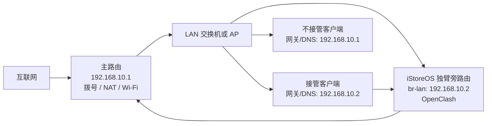

# iStoreOS + OpenClash 独臂旁路由详细设置

本文适用于：主路由负责拨号、NAT 和 Wi-Fi，iStoreOS 设备只有一张网卡或只使用一个 LAN 口，并通过同一根网线接入主路由 LAN/交换机。OpenClash 运行在 iStoreOS 上，为选择的局域网设备提供透明代理。

示例地址如下，请按自己的主路由网段替换：

| 设备 | IPv4 地址 | 默认网关 | DNS |
| --- | --- | --- | --- |
| 主路由 | `192.168.10.1/24` | 运营商上级 | 运营商或自定义 |
| iStoreOS 独臂旁路由 | `192.168.10.2/24` | `192.168.10.1` | `192.168.10.1`、`223.5.5.5` |
| 经 OpenClash 的客户端 | DHCP 或静态地址 | `192.168.10.2` | `192.168.10.2` |
| 不经 OpenClash 的客户端 | DHCP 或静态地址 | `192.168.10.1` | `192.168.10.1` |

关键原则：需要透明代理的客户端，**网关和 DNS 都必须指向 iStoreOS**。只把 DNS 改成 iStoreOS、但网关仍是主路由，应用流量会直接绕过 OpenClash。

## 一、网络拓扑



- iStoreOS 只接一根网线到主路由 LAN 口或交换机。
- iStoreOS、主路由和客户端必须位于同一 IPv4 子网。
- 不要把同一物理网卡同时绑定到 LAN 和 WAN，也不要再接第二根线形成二层环路。
- 主路由仍是唯一互联网出口；iStoreOS 不负责拨号。

## 二、开始前准备

1. 记录主路由 LAN 地址、子网掩码和 DHCP 地址池。
2. 在 DHCP 地址池之外为 iStoreOS 预留一个地址。例如主路由 DHCP 为 `192.168.10.100-199`，iStoreOS 使用 `192.168.10.2`。
3. 最好在主路由中给 iStoreOS 网卡 MAC 建立 DHCP 静态绑定，避免地址被其他设备占用。
4. 准备一台可手动设置 IPv4 的电脑。配置错误时可临时把电脑设为 `192.168.10.20/24`，直接访问 `192.168.10.2` 恢复。
5. 不要同时运行多个 DHCP 服务或多个会劫持 53 端口的插件。

## 三、使用 iStoreOS 旁路由向导

iStoreOS 官方推荐优先使用旁路由设置向导。

1. 先把电脑直接连接 iStoreOS，登录管理页面。
2. 在 iStoreOS 首页打开 **网络向导/网络设置向导**。
3. 选择 **旁路由**，只有一个网口时选择该 LAN 网口。
4. 地址获取方式选择 **固定 IP/静态地址**。
5. 填写：

   ```text
   IPv4 地址：192.168.10.2
   IPv4 子网掩码：255.255.255.0
   IPv4 网关：192.168.10.1
   DNS 服务器：192.168.10.1、223.5.5.5
   ```

6. 如果向导提供 **使用默认网关**，必须勾选。
7. 保存后，管理地址会变为 `http://192.168.10.2`。电脑可能暂时断网，这是正常的。
8. 把 iStoreOS 的单网口连接到主路由 LAN 或交换机，再让电脑回到原局域网。

若没有旁路由向导，可进入 **网络 → 接口 → LAN → 编辑** 手动设置上述静态地址、网关和 DNS，并在 **高级设置** 中确认 **使用默认网关** 已勾选。

## 四、确认 iStoreOS LAN 接口

进入 **网络 → 接口 → LAN → 编辑**：

### 基本设置

- 协议：**静态地址**。
- IPv4 地址：`192.168.10.2`。
- IPv4 子网掩码：`255.255.255.0`。
- IPv4 网关：`192.168.10.1`。
- 使用自定义 DNS：`192.168.10.1`、`223.5.5.5`。

iStoreOS 自身的接口 DNS 不要填写 `192.168.10.2`，否则在 OpenClash 停止或重启时容易形成自指 DNS 循环。客户端 DNS 才填写 `192.168.10.2`。

### 物理设置

- 设备通常为 `br-lan`。
- 只把实际连接主路由的网口加入 `br-lan`。
- 不创建物理 WAN；已有未使用的 WAN/WAN6 可以停止，但不要在不确定接口映射时删除。

### 高级设置

- **使用默认网关**：开启。
- 路由跃点：只有一个默认路由时保持默认即可。
- IPv6 分配长度：隐私方案下保持禁用/不分配。

保存并应用后，在 **网络 → 诊断** 依次测试：

1. Ping `192.168.10.1`。
2. Ping `223.5.5.5`。
3. 使用 NSLookup 解析 `raw.githubusercontent.com`。

前两项成功、第三项失败通常是 iStoreOS 自身 DNS 设置问题。

## 五、选择 DHCP 接管方式

同一局域网只能保留一个 DHCP 服务器。三种方案选择一种：

| 方案 | 主路由 DHCP | iStoreOS DHCP | 适用场景 |
| --- | --- | --- | --- |
| A. 指定设备接管 | 开启 | 关闭 | 少量设备手动走 OpenClash |
| B. 主路由下发全屋接管 | 开启，并把网关/DNS下发为 `.2` | 关闭 | 主路由支持自定义 DHCP 网关和 DNS |
| C. iStoreOS 下发全屋接管 | 关闭 | 开启 | 主路由不能修改 DHCP 网关/DNS |

### 方案 A：只代理指定设备

1. 主路由 DHCP 保持开启。
2. iStoreOS 打开 **网络 → 接口 → LAN → DHCP 服务器**，勾选 **忽略此接口/禁用 DHCP**。
3. 在需要代理的电脑、手机、电视或游戏机上手动设置：

   ```text
   IP：192.168.10.20（不能与其他设备冲突）
   掩码：255.255.255.0
   网关：192.168.10.2
   DNS：192.168.10.2
   ```

4. 其他设备继续使用主路由 DHCP，网关和 DNS 仍为 `192.168.10.1`，不会经过 iStoreOS。

这是最适合首次测试的方案，出问题时只影响测试设备。

### 方案 B：主路由 DHCP 下发全屋接管

1. iStoreOS DHCP 保持关闭。
2. 在主路由 DHCP 设置中修改：

   ```text
   默认网关 / DHCP Option 3：192.168.10.2
   DNS / DHCP Option 6：192.168.10.2
   ```

3. 保存后让客户端断开重连，或重新获取 DHCP 租约。
4. 检查客户端得到的 IP 仍属于 `192.168.10.0/24`，但网关和 DNS 都已经是 `.2`。

如果主路由只能修改 DNS、不能修改 DHCP 网关，不要使用此方案，应改用方案 C。

### 方案 C：由 iStoreOS 下发全屋接管

1. 先关闭主路由 DHCP。
2. 在 iStoreOS 打开 **网络 → 接口 → LAN → DHCP 服务器 → 基本设置**。
3. 取消 **忽略此接口**，设置一个不冲突的地址池，例如 `192.168.10.100-199`。
4. 在 **高级设置 → DHCP 选项** 添加：

   ```text
   3,192.168.10.2
   6,192.168.10.2
   ```

5. 保存并应用，让所有客户端重新连接网络。

切换 DHCP 时可能短暂断网。务必确认主路由 DHCP 已关闭，再启动 iStoreOS DHCP；两个 DHCP 同时工作会导致客户端随机获得错误网关。

## 六、iStoreOS 防火墙设置

进入 **网络 → 防火墙**。

### LAN 区域

编辑 `lan` 区域，建议：

- 入站数据：**接受**。
- 出站数据：**接受**。
- 转发：**接受**。
- 涵盖网络：`lan`。
- **IP 动态伪装/Masquerading**：建议开启。
- **MSS 钳制/MSS clamping**：遇到部分网站能打开但图片或大文件卡住时开启。

独臂旁路由的流量会从 `br-lan` 进入，再从同一个 `br-lan` 发往主路由。动态伪装可以让返回流量稳定地回到 iStoreOS，再交还客户端；代价是主路由看到的来源通常是 iStoreOS 地址。

如果关闭动态伪装后所有 DIRECT 和代理连接都稳定，也可以保持关闭；但遇到“能 Ping、网页打不开”“代理可用、直连失败”或主路由是小米/运营商定制设备时，应优先开启。

### 流量分载

在 **网络 → 防火墙 → 常规设置** 中关闭：

- 软件流量分载/Software flow offloading。
- 硬件流量分载/Hardware flow offloading。

流量分载可能让连接绕过 OpenClash 的透明代理链。确认所有规则长期稳定后才考虑逐项测试开启。

## 七、安装和配置 OpenClash

1. 从 iStore 安装 OpenClash，并确认依赖与 Mihomo/alpha-smart 内核完整。
2. 按 [`openclash-v0.47.156-settings.md`](openclash-v0.47.156-settings.md) 添加订阅转换配置。
3. 自定义模板 URL：

   ```text
   https://raw.githubusercontent.com/zhiwen1987/Jydn-openclash/refs/heads/main/metafenliu.ini
   ```

4. 安装 [`../modules/openclash-dns-privacy-override.yaml`](../modules/openclash-dns-privacy-override.yaml) 覆写模块。
5. **插件设置 → 运行模式**：选择 `fake-ip-mix (tun mix mode)`。
6. 网络栈先选择 `System`；Docker 或 UDP 异常时再测试 `Mixed`。
7. **代理模式**：规则模式。
8. **路由本机代理**：开启，让 iStoreOS 自身更新和规则下载也能按规则访问。
9. **本地 DNS 劫持**：选择防火墙转发。
10. **中国 IP 路由**：禁用，不使用内核外“绕过大陆”。
11. **常用端口代理模式**：禁用，让所有端口先进入 Mihomo。
12. **Smart 策略自动切换**：关闭，保留模板的 `url-test` 最低延迟组。
13. 重启 OpenClash，确认首页显示当前配置和已生效的 `dns-privacy` 覆写模块。

### 旁路由兼容模式

**旁路由兼容模式/Bypass Gateway Compatible** 不建议一开始就打开。若客户端网关和 DNS 已正确指向 `.2`，但 DIRECT 流量、局域网访问或部分主路由组合仍无法工作，可进入 **插件设置 → 流量控制** 开启后对比测试。

该选项用于处理特定旁路由回程/转发兼容问题，不替代正确的 DHCP、网关、DNS 和防火墙设置。

## 八、DNS 路径与防泄漏

正常路径应为：

```text
客户端 → 192.168.10.2:53 → OpenClash/Mihomo:7874
境外域名 → 加密 DNS，经 🔒 隐私代理出站
DIRECT 域名 → 境内 DoH，经 DIRECT 出站
```

检查以下项目：

- 客户端 DNS 必须是 `192.168.10.2`，不能是公网 DNS 或主路由 `.1`。
- OpenClash 防火墙规则应同时劫持 TCP 53 和 UDP 53。
- 不同时启用 AdGuard Home、SmartDNS、MosDNS 或其他 DNS 劫持；若必须共存，需要明确唯一监听端口和单向转发链，不能互相回指。
- 浏览器关闭“安全 DNS”，Android 关闭“私人 DNS”，Apple 设备关闭 iCloud Private Relay 后再测试路由器 DNS。
- DoH/DoT 使用 443/853，不能只靠 53 端口重定向拦截；完整 TUN 接管和客户端设置同样重要。

## 九、IPv6 必须单独处理

独臂旁路由只修改 IPv4 网关时，客户端仍可能从主路由获得 IPv6 默认路由并直接出网，完全绕过 iStoreOS。

在确认 OpenClash、TUN、防火墙和 DNS 能完整接管 IPv6 前：

1. 主路由关闭 LAN 的 RA、DHCPv6 和 IPv6 DNS 下发。
2. iStoreOS 关闭 WAN6、LAN RA、DHCPv6、NDP 代理。
3. OpenClash 关闭代理 IPv6、IPv6 DNS 和中国 IPv6 路由。
4. 客户端断开重连后确认不再获得运营商 IPv6 默认路由。

如果主路由不能关闭 IPv6 下发，应在客户端逐台关闭 IPv6，或暂时不要把这套配置视为完整防泄漏方案。

## 十、Docker 与局域网服务

iStoreOS 经常同时运行 Docker/NAS 服务，需注意：

- Docker 数据应迁移到非系统盘，避免根分区写满影响 OpenClash。
- `strict-route: true` 可能影响部分 Docker 网桥、虚拟机或旁路网关场景。若容器断网，先把覆写模块中的 `strict-route` 临时改为 `false` 对比测试。
- 不要把 Docker 网桥误加入 OpenClash 的 LAN 客户端访问控制。
- 局域网设备位于同一 `/24` 时会直接二层通信，访问 NAS/Samba 通常不经过默认网关。
- 若容器必须经 OpenClash 出网，确认 **路由本机代理**已开启，并在 OpenClash 连接页面检查容器连接是否命中预期策略。

## 十一、完整验证步骤

### 客户端网络参数

Windows 执行：

```powershell
ipconfig /all
nslookup www.google.com
tracert -d 223.5.5.5
```

应看到：

- 默认网关：`192.168.10.2`。
- DNS 服务器：`192.168.10.2`。
- `nslookup` 的服务器是 `192.168.10.2`。
- 第一跳通常是 `192.168.10.2`。

### 连通性顺序

1. Ping iStoreOS：`192.168.10.2`。
2. Ping 主路由：`192.168.10.1`。
3. Ping 公网 IPv4：`223.5.5.5`。
4. 打开国内网站，确认 OpenClash 连接命中 `DIRECT`。
5. 打开海外网站，确认命中具体应用组或 `🌐 Default`。
6. 测试 DNS、IPv6 和 WebRTC，确认没有出现中国公网 IPv4/IPv6 或非预期 DNS。
7. 测试 NAS、打印机、电视投屏和 Docker 服务。

## 十二、故障排查

| 现象 | 优先检查 |
| --- | --- |
| iStoreOS 自己不能联网 | LAN 是否填写 `.1` 默认网关；“使用默认网关”是否勾选；接口 DNS 是否可用 |
| 客户端完全断网 | 客户端网关/DNS 是否都是 `.2`；iStoreOS 是否能 Ping `.1`；LAN 转发是否接受 |
| 能 Ping IP，不能打开域名 | 客户端 DNS、OpenClash 7874、53 劫持、重复 DNS 插件 |
| 代理网站可用，DIRECT 失败 | LAN 动态伪装、旁路由兼容模式、主路由回程 |
| 国内直连但国外不通 | 订阅节点、策略组选择、TUN 状态和 OpenClash 运行日志 |
| 部分网页或下载卡住 | MSS 钳制、MTU、QUIC、网络栈 System/Mixed |
| 只有部分设备偶发错误网关 | 局域网存在两个 DHCP 服务器 |
| 关闭 OpenClash 后客户端断网 | iStoreOS 转发/动态伪装问题；客户端可临时把网关和 DNS 改回 `.1` |
| 仍检测到 IPv6 | 主路由/光猫仍在发送 RA，或客户端缓存了 IPv6 租约 |
| Docker/虚拟机断网 | 临时关闭 `strict-route`，检查 Docker 网桥和 OpenClash 访问控制 |

## 十三、快速恢复

如果配置后无法上网：

1. 在测试客户端把默认网关和 DNS 临时改回主路由 `192.168.10.1`。
2. 访问 `http://192.168.10.2`，停止 OpenClash。
3. 检查 iStoreOS LAN 默认网关、DNS、DHCP 和防火墙动态伪装。
4. 确认局域网只有一个 DHCP 服务。
5. 先恢复方案 A，只让一台测试设备使用 `.2`，验证完成后再切换全屋设备。

不要在故障排查时删除 LAN 接口或重置整个系统；保留固定管理地址更容易恢复。

## 十四、安全边界

- OpenClash 控制面板设置为仅允许内网访问，并设置管理密码。
- 不要在截图、日志或 GitHub 仓库中公开机场订阅地址、节点密码和 Token。
- 独臂旁路由和 DNS/TUN 接管只能降低网络出口与解析路径泄漏；账号地区、GPS/SIM、时区、语言、Cookie、支付资料和浏览器指纹仍可能暴露实际地区。

## 参考资料

- [iStoreOS 官方：旁路由、DHCP 与默认网关说明](https://doc.linkease.com/zh/guide/istoreos/question.html)
- [iStoreOS 官方仓库](https://github.com/istoreos/istoreos)
- [OpenClash 官方仓库](https://github.com/vernesong/OpenClash)
- [OpenClash 官方 DNS 设置说明](https://github.com/vernesong/OpenClash/wiki/DNS%E8%AE%BE%E7%BD%AE)
- [Mihomo TUN 配置](https://wiki.metacubex.one/config/inbound/tun/)
- [Mihomo DNS 配置](https://wiki.metacubex.one/config/dns/)
